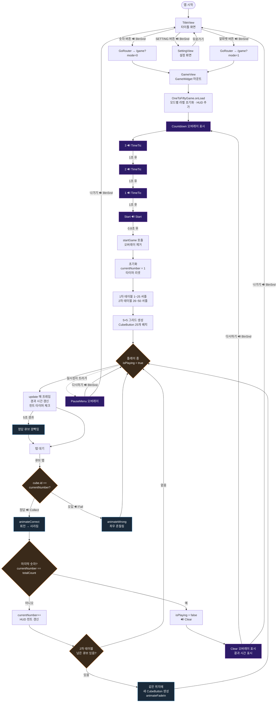

# 1 to 50 게임 플로우차트

## 흐름 요약

| 단계 | 설명 | 효과음 |
|------|------|--------|
| 타이틀 | 모드 선택 (숫자/알파벳/설정) | `BtnSnd.mp3` |
| 카운트다운 | 3 → 2 → 1 → Start | `TimeTic.mp3` × 3, `Start.mp3` |
| 정답 탭 | 큐브 회전·사라짐 → 2차 큐브 등장 | `Collect.mp3` |
| 오답 탭 | 큐브 좌우 흔들림 | `Fail.mp3` |
| 힌트 | 5초 무입력 시 정답 큐브 깜빡임 | - |
| 클리어 | 결과 화면 (시간 표시) | `Clear.mp3` |
| 메뉴 버튼 | 다시하기 / 나가기 | `BtnSnd.mp3` |
